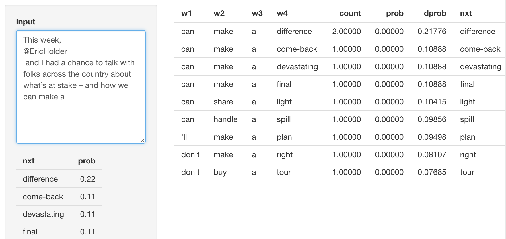
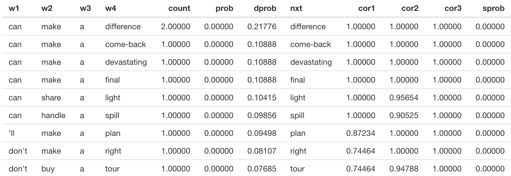
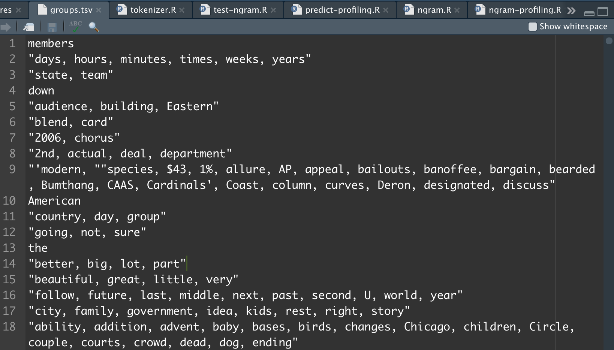

Word Prediction
========================================================
author: Chia-Hsun Cheng
date: 06/26
autosize: true

The User Interface
========================================================

* Enter the text in the input text area
* `nxt`: the next predicted word
* `prob`: the probability of `nxt` under N-gram and correlation

[BarackObama tweets](https://twitter.com/BarackObama/status/1407444434157977601)



```
This week, 
@EricHolder
 and I had a chance to talk with folks across the country about what’s at stake – and how we can make a difference.
```

The Prediction Algorithm
========================================================

From the corpora, we train the 1, 2, 3, 4 gram model.

For each N-gram, we make it a feature function and compute the correlation between words.

Therefore, N-grams with correlation can be possible substitutes for the predicted words. (e.g. `make` `share` with correlation 0.96)



Grouping
========================================================

Since computing a correlation of a big M x N matrix is expensive, we perform grouping using K-means clustering before computing correlation.



Performance Optimization
========================================================

* For performance, we compute the correlation and grouping model and dumping them as archives. On app side, we only have to load the model and perform some lighter computation.

* For user experience, we load a light model first and then load a more heavier model asynchronously using [promise](https://rstudio.github.io/promises/articles/overview.html).
